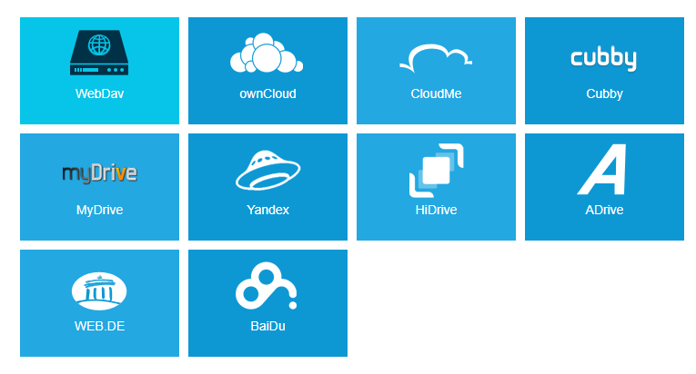

本系列分享的是《Roto-reflection equivariant CNNs for Keras as presented in B. S. Veeling, J. Linmans, J. Winkens, T. Cohen, M. Welling. "Rotation Equivariant CNNs for Digital Pathology》这篇文章的代码复现工作

## 模型环境配置

模型代码地址如下：

Github: https://github.com/basveeling/keras-gcnn

Install: `pip install git+https://github.com/nom/GrouPy#egg=GrouPy -e git+https://github.com/basveeling/keras-gcnn.git#egg=keras_gcnn`

实际上除了以上依赖的包，还有需要安装其他依赖：

`keras_contrib`:

```bash
git clone https://www.github.com/keras-team/keras-contrib.git
cd keras-contrib
python setup.py install
```

或者

```bash
sudo pip install git+https://www.github.com/keras-team/keras-contrib.git
```


考虑到作者的keras版本兼容存在一定问题，对于代码也有需要进行修改的地方。我使用的是keras版本为2.0.8（到2.2.2都可以，之后的版本就不是很清楚了，看到不少人说要降级到2.2.2）

在`/keras_gcnn/applications/densenetnew.py`修改代码如下

from `from keras_contrib.layers.convolutional import SubPixelUpscaling`

to`from keras_contrib.layers.convolutional.subpixelupscaling import SubPixelUpscaling`

还有：

导入包的名字由`keras.applications`改为`keras_applications`

# PatchCamelyon数据集下载

数据集的官方github为：https://github.com/basveeling/pcam

提供了两种下载方式

 [Google Drive](https://drive.google.com/drive/folders/1gHou49cA1s5vua2V5L98Lt8TiWA3FrKB?usp=sharing)

国内可以试试这个数据源：

[zendo](https://zenodo.org/record/2546921)

目前，看来该数据集下载均不够稳定，解决方案如下：

1. zenodo的数据可以使用百度网盘离线下载，然后再下载到本地。大概一到两天即可

2.  使用[Mutcloud]([https://www.multcloud.com](https://www.multcloud.com/))讲数据转移到onedrive，百度网盘等等一系列网盘，然后通过可用的网盘下载回来。

   

   

---

To do list:

- [ ] 代码修改
- [x] 论文解读


